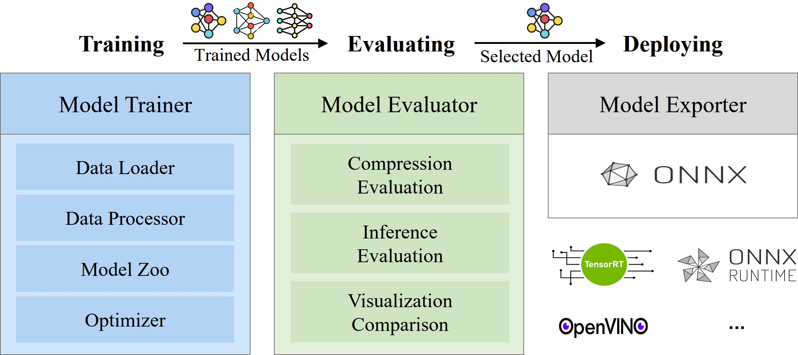
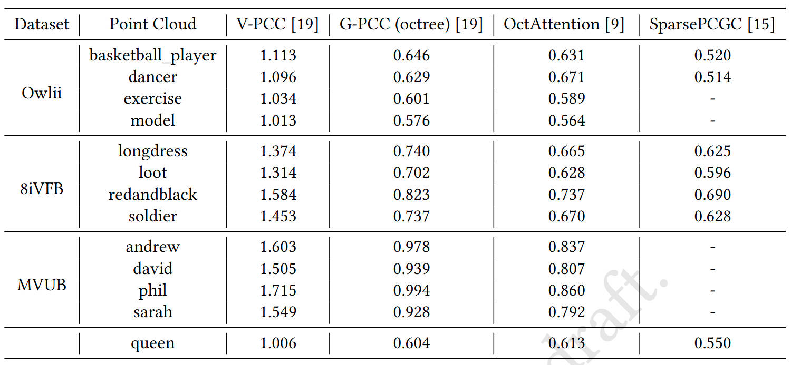
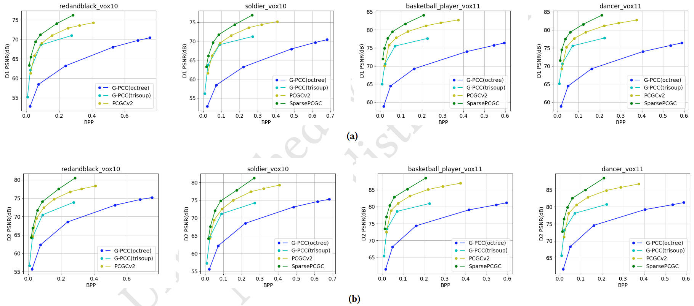

# Bridging Research and Practice: A Training, Evaluating, and Deploying Toolkit for Learning-Based Point Cloud Compression

## Introduction



This toolkit is a unified toolkit bridging research and practical application for learning-based point cloud compression. By consolidating training, evaluation, and deployment workflows, This toolkit facilitates systematic comparisons of compression algorithms with an emphasis on real-world applicability.

## Software Architecture

- **Model Trainer:** Model trainer enables flexible dataset loading, data preprocessing, neural network designing, and model training.
- **Model Evaluator:** Model evaluator facilitates the selection of an optimal model through compression evaluation, inference benchmarking, and visualization comparison.
- **Model Exportor:** Model exporter is provided for converting trained models into the Open Neural Network Exchange (ONNX) format, supporting cross-platform deployment.

## Installation
We recommend using this toolkit with `Python 3.10`, `Pytorch 2.2.2` and `CUDA 11.8`.
```bash
conda create -n PC-TED python==3.10
conda activate PC-TED
pip install torch==2.2.2 torchvision==0.17.2 torchaudio==2.2.2 --index-url https://download.pytorch.org/whl/cu118

git clone —recursive https://gitee.com/rolfma/pc-ted.git
cd pc-ted
chmod +x install.sh
./install.sh
```

## Usage
- Model Trainer: Please refer to `examples/trainer.md`.
- Model Evaluator: Please refer to `examples/evaluator.py`.
- Model Exportor: Please refer to `examples/exportor.py`.

## Algorithm Comparasion
### Compression performance measured by bits per point (bpp) of some lossless intra-frame methods in the model zoo.

### Compression performance presented by rate-distortion curves of some lossy intra-frame methods in our model zoo.



