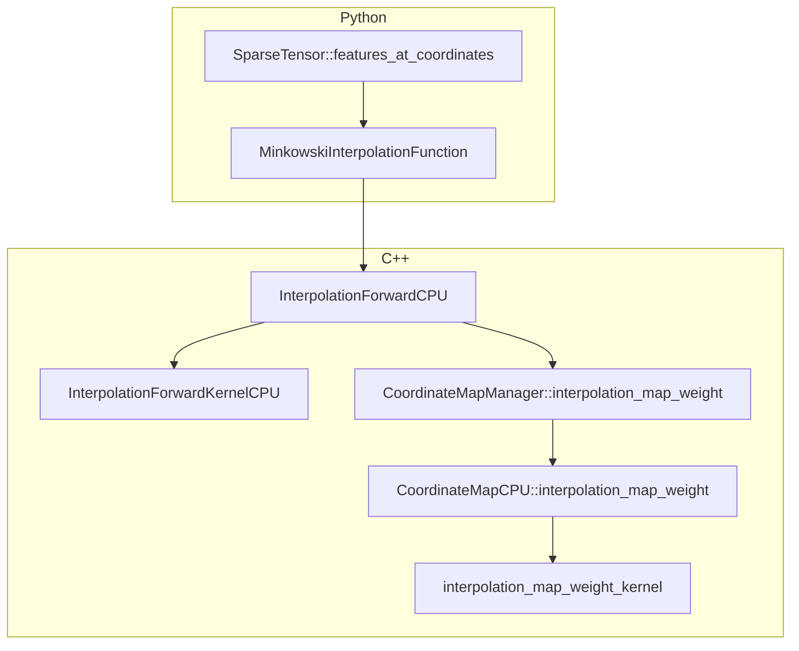

# Minkowski Engine Next Notes
## 总体思想
Minkowski Engine 是一个采用 COO 格式的稀疏张量库，在工程实现上的重点在于管理坐标，除此之外其自动微分和张量等依托于 PyTorch。为了更好地管理坐标原作者设计了优秀的 Coordinate Manager 机制，使得稀疏卷积像`im2col`一样把卷积操作变成了`gemm`操作。

## 现有问题
- TensorField是数据预处理时的存储格式，其在输入到MinkowskiNet之前必须要转成SparseTensor，在目前的实现中，通过`slice()`将SparseTensor转回TensorField存在问题无法使用，同时没有强烈的需求去解决这个问题。

## 基于 Clion 的调试方法
[个人基于CLion的Python/C++混合开发与调试的最佳实践](https://zhuanlan.zhihu.com/p/1906865720916157279)

## SparseTensor::features_at_coordinates 的函数调用关系

